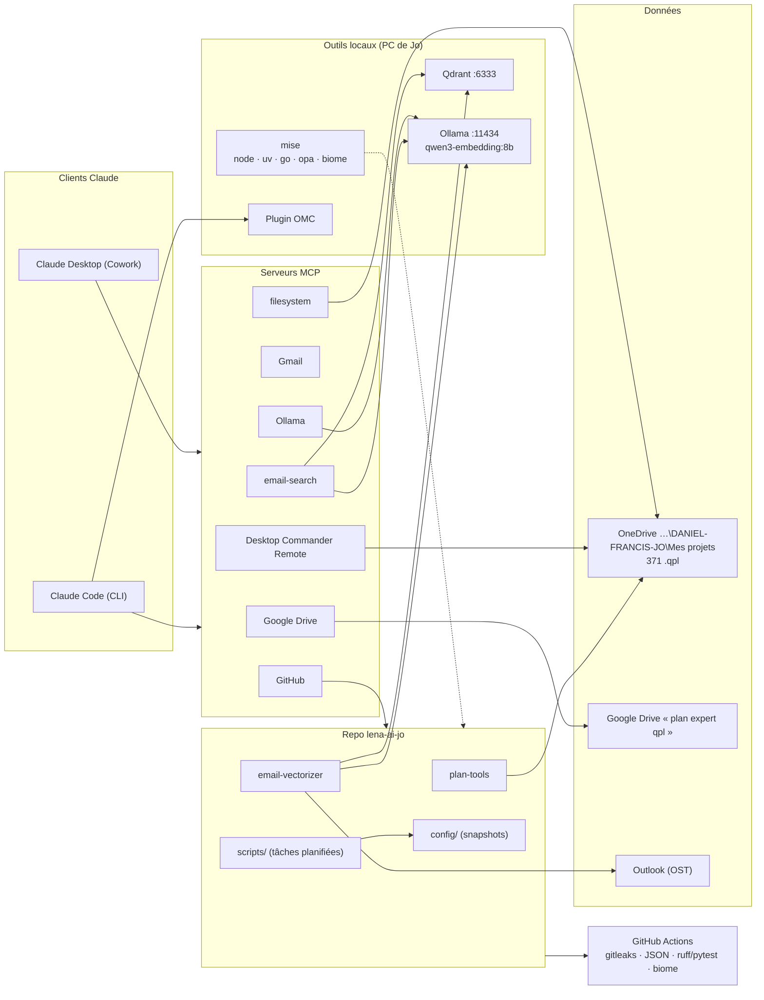

# Architecture

Comment Léna est branchée, de Claude jusqu'à GitHub.

## En bref

| Bloc | Rôle | Où |
|---|---|---|
| Claude Desktop (Cowork) / Claude Code | Là où Jo parle à Léna | PC de Jo, claude.ai |
| Serveurs MCP | Les « mains » de Léna : Drive, Gmail, GitHub, PC à distance, Ollama, fichiers, courriels | Connecteurs claude.ai + `config/claude/mcp.json` |
| Desktop Commander Remote | Laisse claude.ai travailler sur le PC de Jo | Tâche planifiée `Desktop Commander Remote` |
| Qdrant | Base vectorielle (courriels) | `%USERPROFILE%\qdrant`, tâche `Qdrant Vector DB`, http://localhost:6333/healthz |
| Ollama | Embeddings locaux `qwen3-embedding:8b` (4096 dim) | http://localhost:11434 |
| mise | Seul gestionnaire de node, uv, go, opa, biome, outils npm | `config/mise/config.toml` |
| `plan-tools/` | Lecture des plans `.qpl` (inventaire, conduits **(en test)**, bordereau), depuis OneDrive seulement | Ce repo |
| `email-vectorizer/` | Outlook → Ollama → Qdrant + MCP `email-search` — « Retrouve le courriel… » **(bientôt — en attente de la réparation Outlook)** | Ce repo (raccourci `%USERPROFILE%\email-vectorizer`) |
| `config/` | Copie quotidienne de la config, secrets masqués | `scripts/snapshot-config.ps1` |
| `scripts/` | Sauvegarde, snapshot + commit, CI de nuit, installation des tâches | `install-tasks.ps1` |
| GitHub Actions | Vérifie chaque push : secrets, JSON, tests | `.github/workflows/ci.yml` ([CI-CD](CI-CD.md)) |
| CI de nuit | Tests chaque nuit ; si rouge, Claude Code (headless, plafond 2 $) tente une correction | `scripts/lena-nightly.ps1` ([CI-CD](CI-CD.md)) |

## Tâches planifiées

| Tâche | Quand | Script |
|---|---|---|
| `lena-claude-backup` | Ouverture de session + 03:00 | `scripts/backup-claude.ps1` |
| `lena-auto-commit` | 12:00 + ouverture de session (+5 min) | `scripts/auto-commit.ps1` |
| `Desktop Commander Remote` | Ouverture de session (+1 min) + chaque heure | `desktop-commander remote --persist-session` |
| `lena-nightly-ci` | 02:00 (rattrapée au réveil si le PC dormait) | `scripts/lena-nightly.ps1` |
| `Qdrant Vector DB` | Ouverture de session | `qdrant.exe --config-path …\config.yaml` |

Les quatre premières sont créées par `scripts/install-tasks.ps1` (RunLevel Limited, heures locales : elles suivent l'heure d'été). Qdrant reste en RunLevel Highest et n'est pas touchée par ce script.
